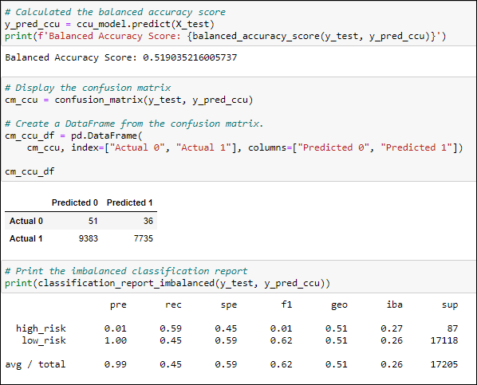
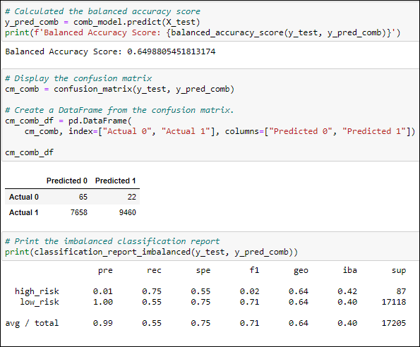

# Credit_Risk_Analysis

## Project Overview

Using Unsupervised Machine learning to analyze and predict credit risk based on a credit card credit dataset from LendingClub. This analysis will employ various algorithms and techniques to build, train and evaluate models with unbalanced classes.

## Resources

- Applications\Software: Jupyter Notebook 6.1.4, 
- Languages\Libraries: pandas, imbalanced-learn, scikit-learn

## Results
### Resampling Models

#### 1. Naive Random Oversampling

- Balanced Accuracy Score: **65%**
- Precison: **99%**
- Recall (Sensitivity): **67%**
- F1 Score: **80%**

#### 2. Random Oversampling with SMOTE

- Balanced Accuracy Score: **65%**
- Precison: **99%**
- Recall (Sensitivity): **65%**
- F1 Score: **78%**

#### 3. Cluster Centroid Undersampling

- Balanced Accuracy Score: **52%**
- Precison: **99%**
- Recall (Sensitivity): **45%**
- F1 Score: **62%**

#### 4. Combination (Over and Under Sampling) with SMOTEENN

- Balanced Accuracy Score: **65%**
- Precison: **99%**
- Recall (Sensitivity): **55%**
- F1 Score: **71%**

---

### Ensemble Classifiers

#### 5. Balanced Random Forest Classifier

- Balanced Accuracy Score: **79%** 
- Precison: **99%**
- Recall (Sensitivity): **91%**
- F1 Score: **95%**

---

#### 6. Easy Ensemble AdaBoost Classifier

- Balanced Accuracy Score: **93%**
- Precison:**99%**
- Recall (Sensitivity): **94%**
- F1 Score: **97%**

## Summary

- The Easy Ensemble AdaBoost Classifier model produced the highest Balanced Accuracy score of 93%.
- The Cluster Centroid Undersampling model produced lowest Balanced Accuracy score of 53%.
- All models produced a Precision score of 99%.
- The Easy Ensemble AdaBoost Classifier model produced the highest Recall (Sensitivity) at 94%.
- The Cluster Centroid Undersampling model produced the lowest Recall (Sensitivity) score of 45%.
- The Easy Ensemble AdaBoost Classifier model produced the highest F1 score of 97%.

Based on the results I would recommend the **Easy Ensemble AdaBoost Classifier** method for predicting credit risk. This method not only produced the highest Balance Accuracy Score of approximately **93%*, but also the highest Recall (Sensitivity) & F1 scores of 94% and 97% respectively.

 
